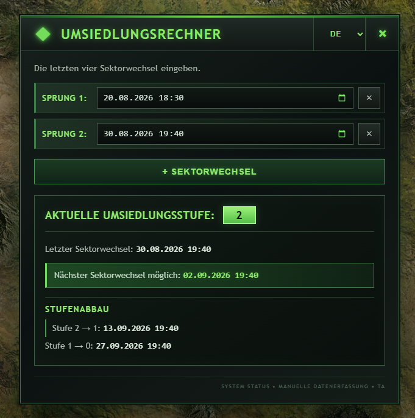

# CnC-TA-Umsiedlungsrechner – Harzi Edition

Ein Tampermonkey-Userscript für **Command & Conquer: Tiberium Alliances** zur Berechnung der aktuellen Umsiedlungsstufe, des nächsten möglichen Sektorwechsels und des Stufenabbaus.

## 🔧 Funktionen

- Eingabe der letzten **vier Sektorwechsel**
- Automatische Berechnung der aktuellen Umsiedlungsstufe
- Berechnung des **nächsten möglichen Sektorwechsels**
- Anzeige des zeitlichen **Stufenabbaus**
- Automatische Prüfung der eingegebenen Daten
- Warnung bei ungültiger Reihenfolge oder zu frühem Sektorwechsel
- Lokale Speicherung der eingegebenen Sektorwechsel
- Ein fünfter Sektorwechsel kann eingegeben werden; anschließend werden weiterhin die letzten vier angezeigt
- Mehrsprachige Oberfläche:
  - 🇩🇪 Deutsch
  - 🇬🇧 English
  - 🇪🇸 Español
  - 🇫🇷 Français

## 📊 Berechnung

Das Script verwendet folgende Umsiedlungsregeln:

| Umsiedlungsstufe | Wartezeit bis zum nächsten Sektorwechsel |
|---|---:|
| Stufe 1 | 1 Tag |
| Stufe 2 | 3 Tage |
| Stufe 3 | 7 Tage |

Die maximale Umsiedlungsstufe beträgt **3**.

Nach jeweils **14 Tagen** ohne weiteren Sektorwechsel wird die Umsiedlungsstufe um eine Stufe reduziert.

## 🖥️ Oberfläche

Der Umsiedlungsrechner wird direkt im Spiel geöffnet. Datum und Uhrzeit der letzten Sektorwechsel können eingegeben werden. Das Ergebnis wird anschließend automatisch berechnet.

## ⚠️ Eingabeprüfung

Das Script prüft unter anderem:

- gültiges Datum und gültige Uhrzeit
- chronologische Reihenfolge der Sektorwechsel
- erforderliche Wartezeit zwischen den Sektorwechseln
- fehlende Eingaben zwischen bereits ausgefüllten Zeilen

Fehler werden direkt im Fenster angezeigt und die betreffende Eingabe wird hervorgehoben.

## 💾 Speicherung

Die eingegebenen Sektorwechsel werden lokal im Browser gespeichert und stehen beim erneuten Öffnen des Rechners wieder zur Verfügung.

Die Speicherung erfolgt getrennt nach Spielwelt.

## 🌍 Mehrsprachigkeit

Die Sprache kann direkt im Rechner ausgewählt werden. Die Auswahl wird gespeichert.

Unterstützte Sprachen:

**Deutsch · English · Español · Français**

## 📥 Installation

Das Script benötigt **Tampermonkey** und läuft auf Command & Conquer: Tiberium Alliances.

Die aktuelle Version befindet sich im Repository:

https://github.com/Harzi66/CnC-TA-Umsiedlungsrechner-Harzi-Edition

Die im Userscript hinterlegte `@downloadURL` und `@updateURL` ermöglichen Tampermonkey, zukünftige Versionen automatisch zu erkennen.

## ⚙️ Voraussetzungen

- Mozilla Firefox oder kompatibler Browser
- Tampermonkey
- Command & Conquer: Tiberium Alliances

## 📌 Aktuelle Version

**1.0.5**

## 👤 Autor

**Harzi**

Harzi's C&C: Tiberium Alliances Userscripts
